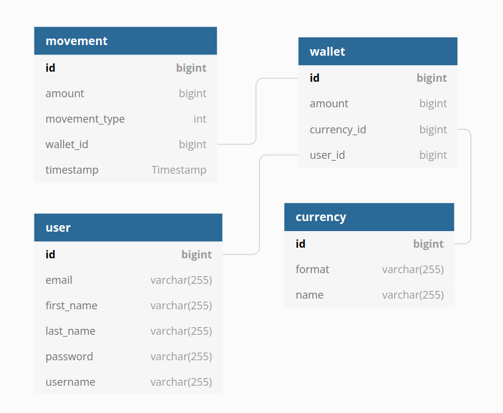

# Technical Documentation

## Running with Docker
### Requirements:
You need to have [**Docker**](https://docs.docker.com/engine/install/ubuntu/) and [**Docker Compose**](https://docs.docker.com/compose/install/) installed.

### Steps:
1. Open a terminal on the project root.

2. In order to use the app with docker you should execute:  
`./gradlew build`

3. Then, build the docker image   
`docker image build -t lemoncash .`

4. Finally, build the docker containers  
`docker-compose up -d`

Your app should be running fine in the 8080 port. You can see example requests in the [User Manual](./user-manual.html).

## Classes UML
TO-DO

## Database Design

 